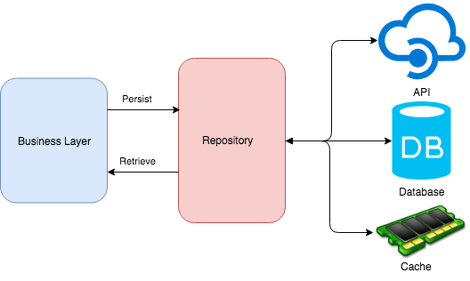

# Resume API using ASP.NET Core 3.1 Web API
สร้าง API ด้วย ASP.NET Core 3.1 ที่สามารถสร้าง resume ได้
โดยมีข้อมูลฟิลด์ตามไฟล์แนบ สามารถ attached รูป และไฟล์ได้ 
โดยใช้ฐานข้อมูล Sqlite 
# Generics
ความสามารถของ generic จะช่วยให้ คนที่เรียกใช้งานเป็นคนกำหนดเองได้ว่า เขาอยากทำงานกับ `data type` อะไร ซึ่งจะช่วยทำให้โค้ดของเรามีความยืดหยุ่นมากขึ้น ลดการเขียนฟังชัน์ที่ซ้ำซ็อน และนำกลับมาใช้ใหม่ได้มากขึ้น สามารถใช้กับตัวแปรและ Method ได้

ตัวอย่าง Code ที่มีการใช้ generics

    public class Dragon<T>
    {
          public T Value { get; set; }
    }

    public class MatherOfDragon
     {
          public void ValarMorghulis()
          {
             var drogon = new Dragon<string>();
             drogon.Value = “RED”;
             var rhaegal = new Dragon<int>();
             rhaegal.Value = 8;
             var viserion = new Dragon<bool>();
             viserion.Value = false;
          }
    }

โดย `Dragon<T>` เรียกว่า **Open Type** ส่วน `<T>` ก็คือ **Type Parameter** 

ตัวอย่างที่สอง

    public class Lannister<T> where T : new ()

จากโค้ดข้างบน `where` จะเรียกว่า **contextual keyword** จะประกอบไปด้วย

> `where T: struct` | T ควรเป็น value type ก็พวก int, bool, Guid, DateTime  
> `where T: class` | T ควรเป็น reference type ก็พวกที่สามารถ nullable: class, string, array, delegate    
> `where T: new()` | new T   
> `where T: <base class>` | derived class ไงงง    
> `where T: <interface>` | T ที่มีการ Implement Interface    
> `where T : U` | T must be or derive from the argument supplied for U.   

# Repository Layer

[Repository pattern](https://medium.com/@nutron/repository-pattern-c66f1cb37f2a) คือ การวางโครงสร้างของโค้ดรูปแบบหนึ่งเพื่อใช้แยก logic สำหรับการเข้าถึงแหล่งข้อมูล (data source) ออกจาก Business layer โดยที่มี Repository Interface ทำหน้าที่เป็นตัวกลางในการติดต่อระหว่าง Business layer กับ Data source โดยจะดึงข้อมูลจาก Data source แล้วแปลงข้อมูลให้อยู่ในรูปที่ทางฝั่ง Business layer สามารถนำไปใช้งานได้ทันที ในทางกลับกันก็สามารถที่จะรับข้อมูลจากฝั่ง Business layer เพื่อนำไปบันทึกลง Data source ได้ด้วย ซึ่งการทำ Repository pattern นี้ทำให้ Business layer ไม่จำเป็นต้องรู้ว่าข้อมูลที่ได้นั้น มาจาก Data source ไหนหรือจะนำไปบันทึกไว้ที่ใด ทำให้เราสามารถสับเปลี่ยน Data source ได้โดยที่ไม่กระทบกับทางฝั่ง Business layer อีกทั้งยังช่วยแยก Logic ที่ซับซ้อนในการเข้าถึงแหล่งข้อมูลออกจาก Business layer ลดการเกิด dependencies ระหว่างโค้ด ทำให้ Business layer มีเฉพาะ Business logic ซึ่งช่วยให้การทำ Automate test เพื่อทดสอบเฉพาะ Business logic ในระดับ Business layer เป็นเรื่องที่ง่ายขึ้น 

 

    
     
    <small>Repository Pattern Simple Diagram</small>

